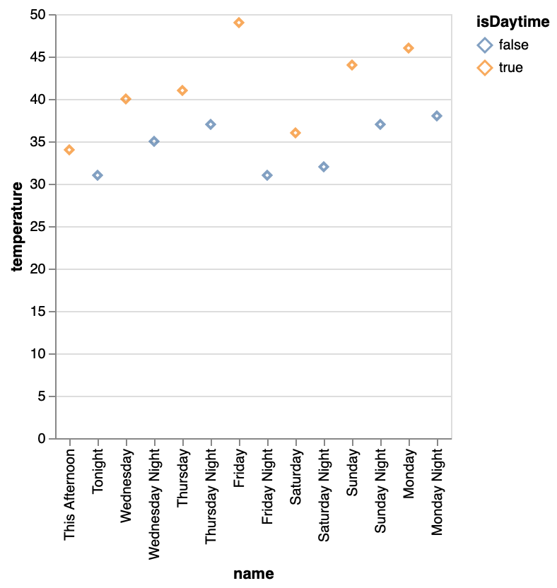

HW 1, CS 625, Fall 2021
================
Dr. Michele Weigle
Sep 9, 2021

## Git, GitHub

1.  *What is your GitHub username?*

priyankavepuri98

2.  *What is the URL of your remote GitHub repo (created through
    Mr. Kennedy’s exercises)?*

<https://github.com/priyankavepuri98/Data_viz.git>

## R

The command below will load the tidyverse package. If you have installed
R, RStudio, and the tidyverse package, it should display a list of
loaded packages and their versions.

``` r
library(tidyverse)
```

    ## ── Attaching packages ─────────────────────────────────────── tidyverse 1.3.1 ──

    ## ✓ ggplot2 3.3.5     ✓ purrr   0.3.4
    ## ✓ tibble  3.1.4     ✓ dplyr   1.0.7
    ## ✓ tidyr   1.1.3     ✓ stringr 1.4.0
    ## ✓ readr   2.0.1     ✓ forcats 0.5.1

    ## ── Conflicts ────────────────────────────────────────── tidyverse_conflicts() ──
    ## x dplyr::filter() masks stats::filter()
    ## x dplyr::lag()    masks stats::lag()

## R Markdown

1.  *Create a bulleted list with at least 3 items*

-   Bread
-   Eggs
-   Milk

2.  *Write a single paragraph that demonstrates the use of italics,
    bold, bold italics, code, and includes a link. The paragraph does
    not have to make sense.*

-   *Data visualization*
-   **CS625**
-   ***Computer Science***
-   `code`
-   [link](https://www.odu.edu)

3.  *Create a level 3 heading*

### level 3 heading

## R

#### Data Visualization Exercises

1.  (Q2) *How many rows are in mpg? How many columns?*

-   Rows: 234
-   Columns: 11

1.  (Q4) *Make a scatterplot of hwy vs cyl.*

``` r
ggplot(data = mpg) + geom_point(mapping = aes(x = hwy, y = cyl))
```

<!-- -->

#### Workflow: basics Exercises

1.  (Q2) *Tweak each of the following R commands so that they run
    correctly (`library(tidyverse)` is correct):*

``` r
library(tidyverse)
ggplot(dota = mpg) + 
  geom_point(mapping = aes(x = displ, y = hwy))

fliter(mpg, cyl = 8)

filter(diamond, carat > 3)
```

``` r
library(tidyverse)
ggplot(data = mpg) + 
  geom_point(mapping = aes(x = displ, y = hwy))

filter(mpg, cyl == 8)

filter(diamonds, carat > 3)
```

## Google Colab

1.  *What are the URLs of your Google Colab notebooks (both Python and
    R)?*

**Python:-**
[Python](https://colab.research.google.com/drive/1LYOt0plk1W3ug7LEOB8mdv7-G5usZce1?usp=sharing)

**R:-**
[R](https://colab.research.google.com/drive/1NeTCTCFNGoZ-_xKirGhOJW2mCJhnJI-k?usp=sharing)

## Tableau

*Insert your the image of your final bar chart here*


1.  *What conclusions can you draw from the chart?* From the chart shown
    above, we can see that the demand on chairs is never disappointing.
    The need of Furniture and Technology is high as compared to Office
    Supplies throughout the year. We can observe that maximum profit is
    obtained on sales of phones.

## Observable and Vega-Lite

### A Taste of Observable

1.  *In the “New York City weather forecast” section, try replacing
    `Forecast: detailedForecast` with `Forecast: shortForecast`. Then
    press the blue play button or use Shift-Return to run your change.
    What happens?*

The description becomes shorter.

1.  *Under the scatterplot of temperature vs. name, try replacing
    `markCircle()` with `markSquare()`. Then press the blue play button
    or use Shift-Return to run your change. What happens? How about
    `markPoint()`?*

-   For markSquare(), the points on the plot changes to square.
-   For markPlot(), the points on the plot changes to unfilled circles.

1.  *Under “Pick a location, see the weather forecast”, pick a location
    on the map. Where was the point you picked near?*

Array(2) \[-97.87, 32.28\]

1.  *The last visualization on this page is a “fancy” weather chart
    embedded from another notebook. Click on the 3 dots next to that
    chart and choose ‘Download PNG’. Insert the PNG into your report.*


### Charting with Vega-Lite

`markCircle()`

1.  *Pass an option of `{ size: 200 }` to `markCircle()`.*


1.  *Try `markSquare` instead of `markCircle`.*


1.  *Try `markPoint({ shape: 'diamond' })`.*



`vl.x().fieldQ("Horsepower")`, …

1.  *Change `Horsepower` to `Acceleration`*

 1. *Swap what fields are displayed on the x-
and y-axis*

 `vl.tooltip().fieldN("Name")`

1.  *Change `Name` to `Origin`.*

When we use ‘Name’ and point the curser on the graph we can see
different car names. When ‘Name’ is changed to ‘Origin’, and point our
curser on the graph, we can observe different country names.

Another example, `count()`

1.  *Remove the `vl.y().fieldN("Origin")` line.*

 1. *Replace `count()` with
`average("Miles_per_Gallon")`.*

 \#\# References

*Every report must list the references that you consulted while
completing the assignment. If you consulted a webpage, you must include
the URL.*

-   Reference 1,
    <https://colab.research.google.com/notebooks/basic_features_overview.ipynb>
-   Reference 2, <https://r4ds.had.co.nz/r-markdown.html>
